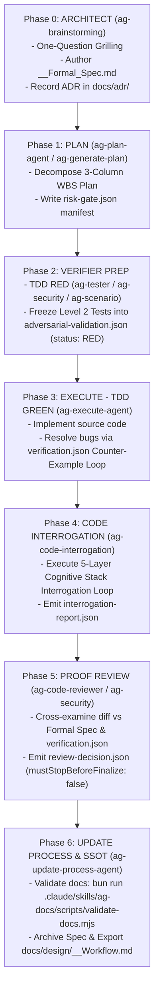

# Master Architect & Verifier Protocol Skill (`ag-architect-verifier`)

> **Operational Purpose:** Coordinates the end-to-end state machine for high-risk technical changes across the `agent-skills-kit` harness: Idea $\rightarrow$ Formal Spec $\rightarrow$ Frozen TDD Suite $\rightarrow$ Counter-Example Loop $\rightarrow$ 5-Layer Socratic Interrogation $\rightarrow$ Proof Review Gate $\rightarrow$ Operational SSOT Documentation.
>
> Reference SSOT Document: `process/development-protocols/references/architect-verifier-master-workflow-guide.md`.

---

## 1. Trigger Conditions & Risk Activation

This skill MUST be activated when executing **High-Risk Class** tasks:
- Auth, JWT, OAuth & Identity boundaries
- Billing, Checkout & Payment Transactions
- DB Schema Migration / Destructive Mutations
- Public API Contract & DTO Changes
- Runtime / Gateway / Proxy / Middleware
- Permission Matrices & Security Boundaries

Keywords: `high risk`, `architect verifier`, `formal spec`, `verification loop`, `TDD RED GREEN`, `proof review`.

---

## 2. The 7-Phase State Machine



---

## 3. Phase-by-Phase Orchestration Summary

### Phase 0: ARCHITECT (`ag-brainstorming`)
- Conduct One-Question Grilling. Discover System Invariants, Fail-Safe Boundaries, Edge Cases.
- Output: `[Feature]_[Topic]_Formal_Spec.md` and ADR in `docs/adr/`.

### Phase 1: PLAN (`ag-plan-agent`)
- Parse invariants, decompose 3-column WBS plan.
- Output: `[feature]_PLAN_[dd-mm-yy].md` and `risk-gate.json`.

### Phase 2: VERIFIER PREP - TDD RED (`ag-tester` / `ag-security` / `ag-scenario`)
- Generate property-based & race-condition tests.
- Output: Test suite files and frozen `adversarial-validation.json` (status: `RED`).

### Phase 3: EXECUTE - TDD GREEN (`ag-execute-agent`)
- Write implementation code. Fix bugs driven by `verification.json` counter-example payloads.
- Output: Source code and `verification.json` (status: `PASS`).

### Phase 4: CODE INTERROGATION (`ag-code-interrogation`)
- Socratic review across 5-Layer Cognitive Stack.
- Output: `interrogation-report.json` (verdict: `PASS`).

### Phase 5: PROOF REVIEW GATE (`ag-code-reviewer` / `ag-security`)
- SAST audit and invariant cross-examination.
- Output: `review-decision.json` (`mustStopBeforeFinalize: false`, `verdict: "APPROVED"`).

### Phase 6: UPDATE PROCESS & SSOT (`ag-update-process-agent`)
- Run `validate-docs.mjs`, archive spec to `completed/`, export operational workflow SSOT.
- Output: `docs/design/<feature-slug>-<topic-slug>-workflow.md`.

---

## 4. Verification Commands

```bash
bun run .claude/skills/ag-docs/scripts/validate-docs.mjs
./scripts/run-audit-parallel.mjs
```
