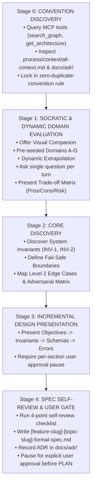

# Interactive Brainstorming Protocol (`ag-brainstorming`)

> **Operational Purpose:** Executes Phase 0 (ARCHITECT) of the Architect & Verifier workflow or any creative feature exploration. Uses Socratic interrogation, MCP-first codebase discovery, Trade-off Matrix analysis, and One-Question Grilling to transform ambiguous user ideas into rigorous Formal Specifications and Architectural Decision Records (ADRs).

---

## 1. Trigger Conditions & Applicability

This skill MUST be used:

- Before any creative work: creating features, building components, adding functionality, or modifying core behavior.
- In **Phase 0 (ARCHITECT)** of the Architect & Verifier Master Workflow.
- When explicitly requested via keywords: `brainstorm`, `spec`, `design`, `approach`, `requirements`, `clarify`, `architect`.

---

## 2. Stage 0: Context & Codebase Convention Discovery (MCP-First)

Before asking the user any questions, agents MUST inspect the living codebase to ground the brainstorming in existing patterns:

1. **Query Knowledge Graph via MCP Tools:**
   - Use `search_graph` to find related functions, classes, routes, or DTOs.
   - Use `get_architecture` and `trace_path` to map dependencies and callers.
   - Use `get_code_snippet` to inspect how similar features are implemented.
2. **Scan Codebase Conventions:**
   - Check `process/context/all-context.md` for project-wide architecture, stack rules, and naming conventions.
   - Check recent ADRs in `docs/adr/` for relevant architectural decisions.
3. **The Zero-Duplicate-Convention Rule:**
   - NEVER propose a second competing convention beside an existing codebase pattern.
   - Explicitly state: _"We follow the pattern established in `<file/module>`, so our design will extend that convention unless a deliberate architectural shift is requested."_

---

## 3. The One-Question Grilling & Interactive Socratic Protocol

To prevent cognitive overload and ensure systematic discovery, agents MUST adhere to **One-Question Grilling**:

1. **Visual Companion Offer:** At the start of ideation, ask if the user wants visual diagrams (`ag-preview`, Mermaid flowcharts, ASCII layouts) alongside prose notes.
2. **One Question Per Turn:** Ask exactly ONE focused question per message. Do NOT stack multiple questions.
3. **Structured Trade-Off Matrix:** When presenting design choices, provide 2-4 distinct options formatted as a Trade-off Matrix:

| Option       | Approach Description    | Pros           | Cons                           | Risk Class | Recommendation  |
| :----------- | :---------------------- | :------------- | :----------------------------- | :--------- | :-------------- |
| **Option A** | _Summary of Approach A_ | _Key benefits_ | _Drawbacks & operational cost_ | Low        | **Recommended** |
| **Option B** | _Summary of Approach B_ | _Key benefits_ | _Drawbacks & operational cost_ | Medium     | Alternative     |

4. **Layered Socratic Questioning Taxonomy:**
   - **Layer 1 (Clarification):** Scope boundaries, core user goal, constraints.
   - **Layer 2 (Probing Assumptions):** Challenge implicit defaults, scalability assumptions, data consistency expectations.
   - **Layer 3 (Perspective Shifts):** Evaluate design from 5 personas (`ag-predict` style): Architect, Security Auditor, Performance Engineer, 6-Month Maintainer, and Adversary.
   - **Layer 4 (Hypothetical & Counterfactuals):** _"What happens if service X fails mid-transaction?"_

---

## 4. Engineering & Architecture Evaluation Framework (Baseline Domains A–G & Dynamic Inference)

During Stage 1 and Stage 2 of brainstorming, agents MUST systematically evaluate the design using the **7 Foundational Baseline Domains (Domain A through Domain G)** while dynamically inferring additional feature-specific domains as needed:

### Foundational Baseline Domains (A – G)

1. **Domain A: Security & Data Privacy**
   - AuthN/AuthZ boundaries, Principle of Least Privilege, Zero Trust access controls.
   - Input validation (Zod schemas), protection against OWASP Top 10 (SQLi, XSS, CSRF).
   - Sensitive data encryption (at rest & in transit), PII handling, audit logging.

2. **Domain B: UI/UX & Usability**
   - Interaction design, user flows, visual hierarchy, layout responsiveness (Tailwind).
   - Accessibility (WCAG standards, keyboard navigation, ARIA attributes).
   - Loading/empty states, optimistic UI, clear error feedback messaging.

3. **Domain C: Performance & Scalability**
   - Latency budgets, throughput targets, rendering/page load time optimization.
   - Database query efficiency (N+1 query elimination, indexing, pagination).
   - Asset & bundle size optimization, caching strategy (Redis, HTTP Cache-Control), rate limiting.

4. **Domain D: Reliability & Resilience**
   - System stability, idempotency guarantees (`INV-2`), fail-safe boundaries.
   - Retry strategies with exponential backoff, transaction boundaries, DB fallback mechanisms.
   - Data integrity, graceful degradation under unexpected failures.

5. **Domain E: Maintainability & Architecture**
   - Zero-Duplicate-Convention compliance, clean architecture & separation of concerns.
   - Design pattern selection (GoF / Functional patterns), strict type safety (TypeScript DTOs).
   - Modularity, low coupling, clarity for the 6-month maintainer.

6. **Domain F: Observability & Operations**
   - Structured logging, error telemetry (Sentry), key operational metrics (RED/USE signals).
   - Operational runbooks, deployment strategy, feature flags, health checks.

7. **Domain G: Business & Compliance**
   - Business invariants (`INV-1`), domain rules, state machine transitions.
   - Regulatory compliance (GDPR, PCI-DSS, licensing), SLA commitments, operational cost limits.

---

### Open-Ended Dynamic Domain Inference Rule

> **Agent Dynamic Reasoning Directive:** The 7 baseline domains above (Domain A–G) are a foundational guide, NOT a closed ceiling. Depending on the feature context, agents MUST dynamically extrapolate, infer, and evaluate additional specialized domains as needed (e.g., _Domain H: Offline-First Sync_, _Domain I: LLM Safety & Prompt Guardrails_, _Domain J: Real-time WebSockets / Streaming_, _Domain K: i18n / Localization_).

---

## 5. Core Discovery Protocol (System Limits & Fail-Safes)

The agent MUST explore and lock in three core structural elements:

### 1. System Invariants

Non-negotiable logic rules that MUST NEVER be violated under any execution state or error condition.

- _Example:_ `INV-1: User wallet balance cannot drop below zero.`
- _Example:_ `INV-2: Webhook payloads with duplicate event_id MUST be idempotently ignored.`

### 2. Fail-Safe Boundary

Safe fallback state when unexpected system failures, timeouts, DB partitions, or network exceptions occur.

- _Example:_ `If payment gateway times out after 5s, transition transaction state to PENDING_VERIFICATION and enqueue background check job.`

### 3. Level 2 Edge Cases & Adversarial Matrix

Race conditions, boundary limits, corrupted inputs, and concurrent state mutations.

- _Example:_ `Two concurrent withdrawal requests of $100 arriving within 1ms when initial balance is $100.`

---

## 6. Incremental Design Presentation & Approval Gates

Do NOT dump the entire technical specification at once. Present the design incrementally section-by-section:

1. **Section 1:** Objectives, Scope & Codebase Context Alignment.
2. **Section 2:** System Invariants (`INV-*`) & Strict Data Schemas (Zod / TypeScript DTOs).
3. **Section 3:** Fail-Safe Boundaries, Execution Flow & Error Handling.
4. **Section 4:** Edge Cases & Adversarial Test Scenarios.

After presenting each section, ask the user: _"Does this section look correct, or should we refine it before moving to the next section?"_

---

## 7. Spec Self-Review Checklist & User Review Gate

Before finalizing deliverables and writing files, the agent MUST run an internal **Spec Self-Review Checklist**:

- [ ] **No Placeholders:** Ensure zero `TODO`, `TBD`, or vague filler phrases exist in the spec.
- [ ] **Internal Consistency:** Invariants match implementation boundaries and DTO contracts.
- [ ] **No Ambiguity:** Could any requirement be interpreted in two conflicting ways?
- [ ] **Codebase Alignment:** Does the design strictly follow existing patterns found in Stage 0?

Once self-review passes, write the spec file, present the path to the user, and enforce an **Explicit User Review Gate**:

> _"Formal Specification has been written to `<path>`. Please review the document and confirm if you approve before we transition to Phase 1 (PLAN / `ag-generate-plan`)."_

---

## 8. Deliverable Artifacts & File Standard

Upon completing the brainstorming loop and reaching agreement, the agent MUST write the following artifacts:

1. **Formal Specification File:**
   - Path: `process/features/[feature-slug]/active/[feature-slug]-[topic-slug]-formal-spec.md`
   - Formatted according to `process/development-protocols/references/formal-spec-template.md`.
   - MUST include a dedicated section: `## 5. Alternatives Considered & Rejected`.

2. **Architectural Decision Record (ADR):**
   - Path: `docs/adr/000X-[kebab-case-name].md` (mandatory whenever non-trivial architectural trade-offs or technology choices are decided).

3. **Harness Manifest (`risk-gate.json`):**
   - Initialize `process/features/[feature-slug]/reports/harness/[planSlug]/risk-gate.json` declaring `formalSpecPath` and `riskClass`.

---

## 9. End-to-End Workflow Architecture

