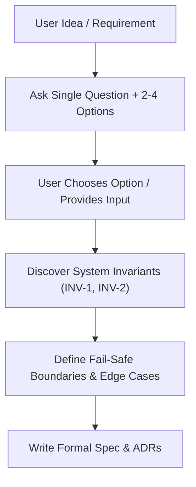

# Interactive Brainstorming Protocol (`ag-brainstorming`)

> **Operational Purpose:** Executes the Phase 0 (ARCHITECT) phase of the Architect & Verifier workflow or any creative feature exploration. Uses Socratic interrogation and One-Question Grilling to transform ambiguous user ideas into rigorous Formal Specifications and Architectural Decision Records (ADRs).

---

## 1. Trigger Conditions & Applicability

This skill MUST be used:
- Before any creative work: creating features, building components, adding functionality, or modifying core behavior.
- In **Phase 0 (ARCHITECT)** of the Architect & Verifier Master Workflow.
- When explicitly requested via keywords: `brainstorm`, `spec`, `design`, `approach`, `requirements`, `clarify`.

---

## 2. The One-Question Grilling Method

To prevent cognitive overload and ensure systematic discovery, agents MUST adhere to **One-Question Grilling**:

1. **One Question Per Turn:** Ask exactly ONE focused question per message. Do NOT stack multiple questions.
2. **Concrete Trade-Off Options:** Provide 2-4 distinct, structured options with concise trade-off descriptions for each option.
3. **Recommend Default:** Clearly mark the recommended option (e.g., `Option A (Recommended): ...`).

---

## 3. Core Discovery Protocol

The agent MUST explore and lock in three core structural elements:

### 1. System Invariants
Non-negotiable logic rules that MUST NEVER be violated under any execution state or error condition.
- *Example:* `INV-1: User wallet balance cannot drop below zero.`
- *Example:* `INV-2: Webhook payloads with duplicate event_id MUST be idempotently ignored.`

### 2. Fail-Safe Boundary
Safe fallback state when unexpected system failures, timeouts, or network partitions occur.
- *Example:* `If payment gateway times out after 5s, transition transaction state to PENDING_VERIFICATION and enqueue background check job.`

### 3. Level 2 Edge Cases & Adversarial Scenarios
Race conditions, boundary limits, corrupted inputs, and concurrent state mutations.
- *Example:* `Two concurrent withdrawal requests of $100 arriving within 1ms when initial balance is $100.`

---

## 4. Deliverable Artifacts

Upon completing the brainstorming loop and reaching agreement, the agent MUST write the following artifacts:

1. **Formal Specification File:**
   - Path: `process/features/[feature-slug]/active/[Feature]_[Topic]_Formal_Spec.md`
   - Formatted according to `process/development-protocols/references/formal-spec-template.md`.

2. **Architectural Decision Record (ADR):**
   - Path: `docs/adr/000X-[kebab-case-name].md` (if major architectural decisions or trade-offs were made).

3. **Harness Manifest (`risk-gate.json`):**
   - Initialize `process/features/[feature-slug]/reports/harness/[planSlug]/risk-gate.json` declaring `formalSpecPath` and `riskClass`.
