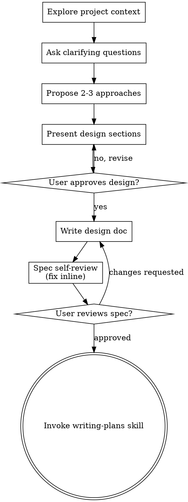

# Comprehensive Brainstorming & Technical Design Guide

This guide provides the complete, uncompressed workflow, Trade-off Matrix structures, 7 Engineering Evaluation Domains (Domain A–G), and system invariant rules for turning ideas into formal, validated designs.

---

## 1. End-to-End Workflow Diagram

---

## 2. Structured Trade-Off Matrix

When presenting technical design choices, provide 2–4 distinct options formatted as a Trade-off Matrix:

| Option       | Approach Description    | Pros           | Cons                           | Risk Class | Recommendation  |
| :----------- | :---------------------- | :------------- | :----------------------------- | :--------- | :-------------- |
| **Option A** | _Summary of Approach A_ | _Key benefits_ | _Drawbacks & operational cost_ | Low        | **Recommended** |
| **Option B** | _Summary of Approach B_ | _Key benefits_ | _Drawbacks & operational cost_ | Medium     | Alternative     |

---

## 3. Engineering & Architecture Evaluation Framework (Baseline Domains A–G)

Systematically evaluate technical designs across 7 baseline engineering domains:

1. **Domain A: Security & Data Privacy**
   - AuthN/AuthZ boundaries, Principle of Least Privilege, Zero Trust access controls.
   - Input validation (Zod schemas), OWASP Top 10 protection (SQLi, XSS, CSRF).
   - Sensitive data encryption (at rest & in transit), PII handling, audit logging.

2. **Domain B: UI/UX & Usability**
   - Interaction design, user flows, visual hierarchy, layout responsiveness (Tailwind).
   - Accessibility (WCAG standards, keyboard navigation, ARIA attributes).
   - Loading/empty states, optimistic UI, clear error feedback messaging.

3. **Domain C: Performance & Scalability**
   - Latency budgets, throughput targets, rendering/page load time optimization.
   - Database query efficiency (N+1 query elimination, indexing, pagination).
   - Asset & bundle size optimization, caching strategy (Redis, HTTP Cache-Control), rate limiting.

4. **Domain D: Reliability & Resilience**
   - System stability, idempotency guarantees (`INV-2`), fail-safe boundaries.
   - Retry strategies with exponential backoff, transaction boundaries, DB fallback mechanisms.
   - Data integrity, graceful degradation under unexpected failures.

5. **Domain E: Maintainability & Architecture**
   - Zero-Duplicate-Convention compliance, clean architecture & separation of concerns.
   - Design pattern selection (GoF / Functional patterns), strict type safety (TypeScript DTOs).
   - Modularity, low coupling, clarity for the 6-month maintainer.

6. **Domain F: Observability & Operations**
   - Structured logging, error telemetry (Sentry), key operational metrics (RED/USE signals).
   - Operational runbooks, deployment strategy, feature flags, health checks.

7. **Domain G: Business & Compliance**
   - Business invariants (`INV-1`), domain rules, state machine transitions.
   - Regulatory compliance (GDPR, PCI-DSS, licensing), SLA commitments, operational cost limits.

---

## 4. Core Discovery Protocol (System Invariants & Fail-Safes)

- **System Invariants (`INV-1`, `INV-2`)**: Non-negotiable logic rules that MUST NEVER be violated under any execution state or error condition.
- **Fail-Safe Boundary**: Safe fallback state when unexpected system failures, timeouts, DB partitions, or network exceptions occur.
- **Level 2 Edge Cases & Adversarial Matrix**: Race conditions, boundary limits, corrupted inputs, and concurrent state mutations.

---

## 5. 8-Step Brainstorming Checklist

1. **Explore project context**: Check codebase, existing architecture, and recent commits.
2. **Ask clarifying questions**: Ask questions one at a time to clarify purpose, constraints, and success criteria.
3. **Propose 2–3 approaches**: Evaluate options with explicit Trade-off Matrix (Pros/Cons/Risk).
4. **Present design in sections**: Present design incrementally scaled to complexity; obtain user approval per section.
5. **Write design doc / Formal Spec**: Save to `process/features/{feature}/references/YYYY-MM-DD-<topic>-design.md` or formal spec path for high-risk features.
6. **Spec self-review**: Conduct an internal check for placeholders, contradictions, and scope creep.
7. **User spec review**: Present written spec for final user confirmation.
8. **Transition to implementation planning**: Invoke the `ag-generate-plan` skill.
