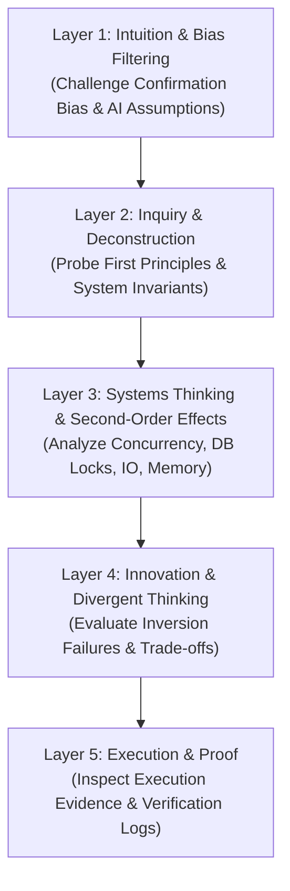

# Socratic Code Interrogation Protocol (`ag-code-interrogation`)

> **Operational Purpose:** Verifies that developers and AI agents truly understand recent codebase changes, AI-generated logic, and underlying system invariants before code finalization. Prevents "auto-pilot acceptance" of subtle bugs, hidden race conditions, or unhandled edge cases.

---

## 1. Trigger Conditions & Applicability

This skill MUST be invoked during:

- **Phase 4 (Code Interrogation)** of the Architect & Verifier Master Workflow.
- Any pull request or major feature review involving complex logic, concurrent state updates, financial/identity boundaries, or AI-generated code blocks.
- When explicitly requested via keywords: `interrogation`, `Socratic review`, `code interview`, `verify understanding`, `code challenge`.

---

## 2. The 5-Layer Cognitive Stack

Interrogations MUST traverse all five cognitive layers in sequence. Do NOT skip layers or rely on surface-level syntax checks.

### Layer Breakdown & Specific Focus Areas

| Layer       | Name                                  | Objective                                                                    | Target Questions & Interrogation Focus                                                                                                                                                            |
| :---------- | :------------------------------------ | :--------------------------------------------------------------------------- | :------------------------------------------------------------------------------------------------------------------------------------------------------------------------------------------------ |
| **Layer 1** | **Intuition & Bias Filtering**        | Filter out hand-wavy assumptions, confirmation bias, and unexamined AI code. | • "Which specific lines in this diff were generated by AI, and which did you write yourself?" • "What assumption in this code are you most afraid is wrong?"                                   |
| **Layer 2** | **Inquiry & Deconstruction**          | Deconstruct logic to first principles and verify System Invariants.          | • "What invariant (`INV-X`) from the Formal Spec does this block defend, and how?" • "If input parameter X is null or corrupted, where is the boundary check?"                                 |
| **Layer 3** | **Systems Thinking & Ripple Effects** | Probe second-order impacts on system state, IO, concurrency, and memory.     | • "How does this method behave under 500 concurrent requests executing within 1ms?" • "Does this DB query acquire a shared or pessimistic lock (`FOR UPDATE`), and what is the deadlock risk?" |
| **Layer 4** | **Divergent Thinking & Inversion**    | Force failure mode inversion and trade-off analysis.                         | • "How would an attacker or race condition bypass this check?" • "What alternate architectural pattern was rejected, and why is this choice superior?"                                         |
| **Layer 5** | **Execution & Proof**                 | Inspect concrete verification evidence and telemetry.                        | • "Where is the property-based test (`fast-check`) proving this edge case?" • "Can you show the exact counter-example log from `verification.json` that was resolved?"                         |

### Integration with Foundational Engineering Domains (A – G)

During Layer 3 (Systems Thinking) and Layer 4 (Divergent Thinking), interrogations MUST evaluate the diff against the **7 Foundational Baseline Domains**:

- **Security (Domain A):** AuthN/AuthZ boundaries, Zod schema validation, OWASP Top 10, data encryption.
- **UI/UX (Domain B):** Responsive layout, WCAG accessibility, loading/empty states, optimistic UI messaging.
- **Performance (Domain C):** Latency budgets, query optimization (N+1), Redis caching, bundle size.
- **Reliability (Domain D):** Idempotency (`INV-2`), fail-safe boundaries, retry strategies, DB locks.
- **Maintainability (Domain E):** Zero-Duplicate-Convention compliance, clean separation of concerns, strict TS types.
- **Observability (Domain F):** Structured logging, telemetry (Sentry), RED/USE metrics.
- **Compliance & Business (Domain G):** Business invariants (`INV-1`), state transitions, regulatory bounds.

---

## 3. Step-by-Step Interrogation Protocol

### Step 1: Pre-Interrogation Reconnaissance

1. Read the git diff (`git diff HEAD~1` or specific commit range).
2. Read the Formal Spec at `formalSpecPath` (if High-Risk) or the active plan file.
3. Extract all explicitly stated System Invariants (`INV-1`, `INV-2`, etc.).

### Step 2: Formulate Socratic Questions

- Generate 1-2 targeted questions per layer.
- Format questions to require technical explanation, code references, or architectural trade-off justification (never simple yes/no answers).

### Step 3: Conduct Socratic Q&A Loop

- Present questions iteratively or in structured layer batches.
- Evaluate responses against actual code implementation and Formal Spec bounds.
- If a response reveals a gap in understanding or an unhandled edge case:
  - Do NOT immediately provide the fix.
  - Ask a follow-up probing question guiding the user/agent to discover the flaw themselves.

### Step 4: Gate Decision & Output

- **PASS Criteria:** Developer/Agent demonstrates 100% conceptual mastery across all 5 layers, and zero unverified invariants remain.
- **FAIL / RETRY Criteria:** Unresolved race conditions, hand-wavy explanations of AI logic, or unhandled invariant breaches.

---

## 4. Output Artifact (`interrogation-report.json`)

Upon completing the interrogation loop, emit an `interrogation-report.json` summary report to:
`process/features/[feature]/reports/harness/[planSlug]/interrogation-report.json`

> **Canonical Schema Specification:** Refer to Section 5 of [`harness-schemas.md`](process/development-protocols/references/harness-schemas.md) for the complete JSON Schema (Draft-07 compliant) definition and rich production template.

---

## 5. Reference Protocols & Schemas

- **Master Workflow Guide:** [`process/development-protocols/references/architect-verifier-master-workflow-guide.md`](process/development-protocols/references/architect-verifier-master-workflow-guide.md)
- **Harness SSOT Schemas:** [`process/development-protocols/references/harness-schemas.md`](process/development-protocols/references/harness-schemas.md)
