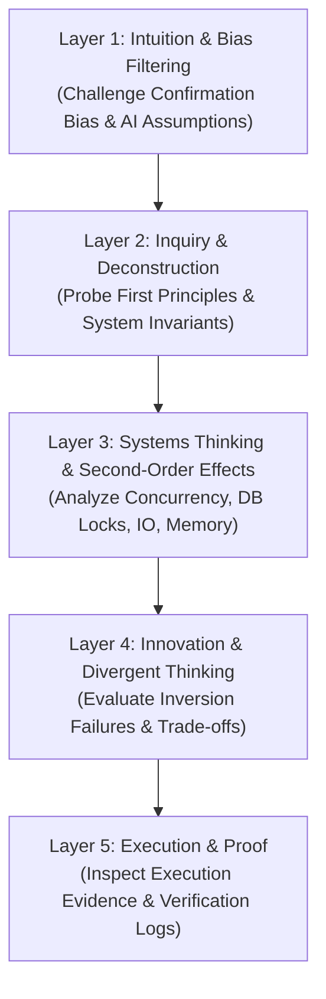

# Socratic Code Interrogation Protocol Guide & Reference

> **Operational Purpose:** Defines the deep Socratic Code Interrogation protocol, the 5-Layer Cognitive Stack, communication modes, circuit breaker rules, severity matrices, and the complete schema for `interrogation-report.json`.

---

## 1. The 5-Layer Cognitive Stack

Interrogations MUST traverse all five cognitive layers in sequence. Do NOT skip layers or rely on surface-level syntax checks.



### Layer Breakdown & Focus Areas

| Layer       | Name                                  | Objective                                                                    | Target Questions & Interrogation Focus                                                                                                                                                            |
| :---------- | :------------------------------------ | :--------------------------------------------------------------------------- | :------------------------------------------------------------------------------------------------------------------------------------------------------------------------------------------------ |
| **Layer 1** | **Intuition & Bias Filtering**        | Filter out hand-wavy assumptions, confirmation bias, and unexamined AI code. | • "Which specific lines in this diff were generated by AI, and which did you write yourself?"<br>• "What assumption in this code are you most afraid is wrong?"                                   |
| **Layer 2** | **Inquiry & Deconstruction**          | Deconstruct logic to first principles and verify System Invariants.          | • "What invariant (`INV-X`) from the Formal Spec does this block defend, and how?"<br>• "If input parameter X is null or corrupted, where is the boundary check?"                                 |
| **Layer 3** | **Systems Thinking & Ripple Effects** | Probe second-order impacts on system state, IO, concurrency, and memory.     | • "How does this method behave under 500 concurrent requests executing within 1ms?"<br>• "Does this DB query acquire a shared or pessimistic lock (`FOR UPDATE`), and what is the deadlock risk?" |
| **Layer 4** | **Divergent Thinking & Inversion**    | Force failure mode inversion and trade-off analysis.                         | • "How would an attacker or race condition bypass this check?"<br>• "What alternate architectural pattern was rejected, and why is this choice superior?"                                         |
| **Layer 5** | **Execution & Proof**                 | Inspect concrete verification evidence and telemetry.                        | • "Where is the property-based test (`fast-check`) proving this edge case?"<br>• "Can you show the exact counter-example log from `verification.json` that was resolved?"                         |

---

## 2. Communication Modes & Protocols

Interrogations MUST adapt their communication channel based on participant roles:

### Agent-to-Human Mode (Pair Programming / Interactive Review)

- Present 1–2 Socratic questions per turn via interactive CLI/ask dialog.
- Wait for human response before proceeding to the next layer.
- Guide the developer toward self-discovery of flaws without giving immediate code fixes (**Zero-Code-Handout Policy**).

### Agent-to-Agent Mode (Autonomous Harness Pipeline)

- Interrogator Agent sends structured Socratic evaluation prompts via `hub` messaging to the Executor Agent.
- Executor Agent must provide technical reasoning, commit/diff line references, and invariant defense proofs.

---

## 3. Protocol Rules & Guardrails

### 3.1 Loop Termination & Circuit Breaker (3-Strikes Rule)

- **Max Iterations:** A maximum of **3 probing turns** is allowed per Layer/Topic.
- **Circuit Breaker Trigger:** If after 3 turns the interrogatees explanation remains hand-wavy, unverified, or an Invariant breach (`INV-X`) persists:
  - Trigger Circuit Breaker: Set `circuitBreakerTriggered: true` and `gateVerdict: "FAIL"`.
  - Immediately terminate interrogation and route the task back to Phase 3 (TDD GREEN Fix).

### 3.2 Verdict & Severity Classification Matrix (3-Lane Policy)

| Severity Level          | Trigger Condition                                                     | Verdict / Gate Action                                               |
| :---------------------- | :-------------------------------------------------------------------- | :------------------------------------------------------------------ |
| **CRITICAL (Red Lane)** | Invariant breach (`INV-X`), unhandled race condition, or DB deadlock. | **`FAIL`** (Block release; route to Phase 3 for repair)             |
| **MAJOR (Yellow Lane)** | Unclear AI-generated code boundary or weak property test.             | **`RETRY`** (Max 3 turns) or **`PASS_WITH_CONCERNS`** (Track issue) |
| **MINOR (Green Lane)**  | Minor telemetry gap or non-critical edge-case documentation note.     | **`PASS`** (Approve gate)                                           |

### 3.3 Incremental Flushing Rule (Context-Overflow Protection)

- To prevent agent memory loss and context overflow during long Socratic sessions, **`interrogation-report.json` MUST BE FLUSHED/UPDATED AFTER EVERY SINGLE Q&A TURN**.
- Every turn appends the latest Q&A entry into `qaTrace` and updates `identifiedRisks` immediately.

---

## 4. Artifact Schema: `interrogation-report.json`

### Field Definitions & Requirements

- `featureSlug` _(string, required)_: Feature slug name.
- `planSlug` _(string, required)_: Associated plan file slug.
- `interrogatedAt` _(string, required)_: ISO timestamp of interrogation start.
- `lastUpdatedAt` _(string, required)_: ISO timestamp of latest incremental flush.
- `gateVerdict` _(string, required)_: Enum `["PASS", "PASS_WITH_CONCERNS", "FAIL"]`.
- `circuitBreakerTriggered` _(boolean, required)_: `true` if max turns reached without resolution.
- `layersEvaluated` _(array, required)_: List of evaluated layers (`["L1_BIAS", "L2_INVARIANTS", "L3_SYSTEMS", "L4_INVERSION", "L5_PROOF"]`).
- `invariantsVerified` _(array, required)_: List of verified invariant IDs (e.g. `["INV-1", "INV-2"]`).
- `identifiedRisks` _(array, required)_: Array of risk items:
  - `riskId` _(string)_: Unique risk identifier (`RISK-1`).
  - `layer` _(string)_: Layer code (`L3_SYSTEMS`).
  - `severity` _(string)_: Enum `["CRITICAL", "MAJOR", "MINOR"]`.
  - `description` _(string)_: Clear risk description.
  - `mitigationStatus` _(string)_: Enum `["OPEN", "MITIGATED", "RESOLVED"]`.
  - `mitigationNotes` _(string)_: Explanation of mitigation.
- `qaTrace` _(array, required)_: Chronological trace of Q&A turns:
  - `turn` _(number)_: Turn index starting from 1.
  - `layer` _(string)_: Layer code evaluated in this turn.
  - `question` _(string)_: Socratic question asked.
  - `response` _(string)_: Participant response.
  - `evaluation` _(string)_: Enum `["ACCEPTABLE", "HAND_WAVY", "FLAWED"]`.
  - `turnScore` _(number)_: Score from 1 to 5.
- `summaryNotes` _(string, required)_: Synthesis summary.

### Invariant Validation Rules (Enforced by Script)

1. **CRITICAL Risk Rule:** If any item in `identifiedRisks` has `severity === "CRITICAL"` and `mitigationStatus !== "RESOLVED"`, `gateVerdict` CANNOT be `"PASS"` or `"PASS_WITH_CONCERNS"`. It MUST be `"FAIL"`.
2. **Circuit Breaker Rule:** If `circuitBreakerTriggered === true`, `gateVerdict` MUST be `"FAIL"`.
3. `qaTrace` MUST be non-empty for completed interrogations.

---

## 5. Artifact Validation Script

The artifact MUST be validated using the automated script:

```bash
bun .claude/skills/ag-code-interrogation/scripts/validate-interrogation-report.mjs <path-to-report.json>
```
