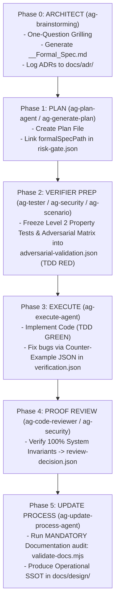

<div align="center">

<a href="https://flowser.ai">
  
</a>

_Built by world-class engineers, for agent-skillsrs at_<br>
_[flowser.ai](https://flowser.ai) — AI Agents with computers for GTM_

<br>

# Agent Skills Kit

<br>

<p align="center">
  <em>"Total Concentration — Formal Spec & Verifier Breathing: The Flow never breaks."</em>
</p>

_A production-grade meta harness for AI coding agents (Claude Code, Codex, Antigravity, Cursor, Windsurf) featuring the **Formal Architect & Verifier Paradigm**, RIPER-5 spec-driven development, Level 2 Property-Based TDD, Counter-Example feedback loops, and centralized ADR management._

🔬 **Spec-Driven & Verification-First** for AI agents<br>
🛡️ **Risk-Based Tiering**: High-Risk formal verification vs Low-Risk fast mode<br>
🧠 **Centralized ADRs & SSOT Knowledge Base** (`docs/adr/`)<br>
⚡ **Autonomous Counter-Example Loops** (TDD RED-GREEN via `verification.json`)<br>
🤝 **Cross-Agent Compatibility** (Claude Code, Codex, Antigravity)

<p>
  <a href="https://github.com/ngxccc/agent-skills-kit/stargazers"></a>
  <a href="LICENSE"></a>
  
  
  
</p>

</div>

---

## 🚀 Quick Start (30 Seconds)

Run this inside your target project directory:

```bash
curl -fsSL https://raw.githubusercontent.com/ngxccc/agent-skills-kit/main/install.sh | bash
```

Then open your agent (Claude Code, Codex, or Antigravity) and say:

```text
Run ag-setup
```

The setup skill detects your stack, scaffolds the process directory structure, scans your codebase, and populates authoritative context entrypoints.

---

## 🏛️ Architecture: Architect & Verifier Paradigm

This harness operates on the **Architect & Verifier Paradigm** combined with the **RIPER-5 Spec-Driven System**:



### Risk-Based Tiering (Option B)

| Risk Class        | Targets / Domain                                                  | Protocol & Verification                                                                                          | Key Artifacts                                                                                                                       |
| :---------------- | :---------------------------------------------------------------- | :--------------------------------------------------------------------------------------------------------------- | :---------------------------------------------------------------------------------------------------------------------------------- |
| **High-Risk**     | Auth, Billing, DB Migrations, Public APIs, Gateway/Proxy, Secrets | **Formal Specification & Verification** (One-Question Grilling, Invariants, TDD Frozen Matrix, Counter-Examples) | `<Feature>_<Topic>_Formal_Spec.md`, `risk-gate.json`, `adversarial-validation.json`, `verification.json`, `docs/adr/` |
| **Low-Risk / UI** | Formatting, Typo, Cosmetic CSS, Simple UI Components              | **Lightweight FAST MODE** (Direct planning & implementation)                                                     | Direct plan file                                                                                                                    |

---

## 📁 Repository Structure & Governance

```
your-project/
├── .claude/
│   ├── agents/              # 🤖 14 Specialized Agent Prompts (ag-research-agent, ag-execute-agent, etc.)
│   └── skills/              # ⚡ 31 Workflow & Helper Skills (ag-brainstorming, ag-generate-plan, etc.)
├── .codex/
│   └── agents/              # 🔄 Mirrored TOML Agent Definitions for Codex
├── process/
│   ├── development-protocols/# 📖 Development Standards, Phase Rules & Workflow Guides
│   ├── context/             # 🧠 Authoritative Repository Context Entrypoints (all-context.md)
│   ├── general-plans/       # 📋 Active, Completed, & Backlog Plan Files
│   └── features/            # 📁 Feature-Scoped Plans, Reports, & References
├── second-brain/
│   └── Docs/
│       ├── ADRs/            # 🏛️ Centralized Architectural Decision Records (000X-<name>.md)
│       └── <Topic>/         # 📜 Post-Implementation Operational SSOT Workflows
├── AGENTS.md                # 📖 Codex Compatibility Layer & Agent Registry
└── CLAUDE.md                # 📋 Orchestration Protocol & Mode Auto-Routing
```

---

## 🛠️ Key Capabilities & Agents

### Core RIPER-5 Agents

- **`ag-research-agent`**: Information gathering (Read-only).
- **`ag-innovate-agent`**: Exploration of technical approaches & architectural decision logging via `ag-docs adr`.
- **`ag-plan-agent`**: Writes structured execution plans linked to `formalSpecPath`.
- **`ag-execute-agent`**: Code implementation driven by TDD RED-GREEN counter-example feedback loops (`verification.json`).
- **`ag-fast-mode-agent`**: Compressed workflow for low-risk features.
- **`ag-update-process-agent`**: Post-execution process reconciliation, mandatory documentation validation (`validate-docs.mjs`), and SSOT archival.

### Specialist Verification Agents & Helpers

- **`ag-brainstorming`**: Architect Phase gate with One-Question Grilling & Formal Spec creation.
- **`ag-docs`**: Unified documentation management & validation targeting `docs/adr/`, `docs/rfc/`, and `docs/design/`.
- **`ag-tester` / `ag-security` / `ag-scenario`**: Level 2 Property-Based Testing (`fast-check`), STRIDE audits, and Adversarial Matrix freeze into `adversarial-validation.json`.
- **`ag-workflow-doc`**: Dual-stage documentation (Pre-impl Formal Spec & Post-impl SSOT Operational Workflow).
- **`ag-second-brain`**: Obsidian Second Brain integration for durable knowledge management.

---

## 📜 Master Playbook & Documentation

Detailed operational guides and prompt templates are available in:

- 📖 [Architect & Verifier Operational Playbook](process/development-protocols/references/architect-verifier-master-workflow-guide.md)
- 📋 [Formal Specification Template](process/development-protocols/references/formal-spec-template.md)
- 📐 [Workflow Documentation Standard](process/development-protocols/references/workflow-documentation-standard.md)

---

## 📄 License

[MIT License](LICENSE)
