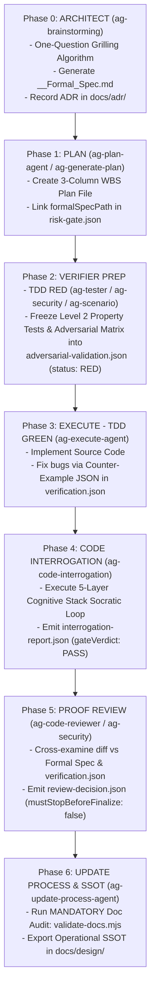

<div align="center">

<a href="https://flowser.ai">
  
</a>

_Built by world-class engineers, for agent-skillsrs at_<br>
_[flowser.ai](https://flowser.ai) — AI Agents with computers for GTM_

<br>

# Agent Skills Kit

<br>

<p align="center">
  <em>"Total Concentration — Formal Spec & Verifier Breathing: The Flow never breaks."</em>
</p>

_A production-grade meta harness for AI coding agents (Claude Code, Codex, Antigravity, Cursor, Windsurf) featuring the **Formal Architect & Verifier Paradigm**, RIPER-5 spec-driven development, Level 2 Property-Based TDD, Counter-Example feedback loops, 5-Layer Socratic Code Interrogation, and centralized ADR management._

🔬 **Spec-Driven & Verification-First** for AI agents<br>
🛡️ **Risk-Based Tiering**: High-Risk formal verification vs Low-Risk fast mode<br>
🧠 **Centralized ADRs & SSOT Knowledge Base** (`docs/adr/`)<br>
⚡ **Autonomous Counter-Example Loops** (TDD RED-GREEN via `verification.json`)<br>
🧩 **5-Layer Socratic Code Interrogation** (`ag-code-interrogation`)<br>
🤝 **Cross-Agent Compatibility** (Claude Code, Codex, Antigravity)

<p>
  <a href="https://github.com/ngxccc/agent-skills-kit/stargazers"></a>
  <a href="LICENSE"></a>
  
  
  
</p>

</div>

---

## 🚀 Quick Start (30 Seconds)

Run the raw CLI binary directly inside your target project directory:

```bash
curl -fsSL https://raw.githubusercontent.com/ngxccc/agent-skills-kit/main/bin/ag-cli -o /tmp/ag-cli && chmod +x /tmp/ag-cli && /tmp/ag-cli -y
```

The CLI automatically detects your technology stack, scaffolds the process directory structure, copies all agent/skill layers, and populates authoritative context entrypoints (`process/context/all-context.md`).

## 🏛️ Architecture: Architect & Verifier Paradigm

This harness operates on the **Architect & Verifier Paradigm** integrated with the **RIPER-5 Spec-Driven Development System**:



### Risk-Based Tiering Decision Matrix

| Risk Class          | Domain & Triggers                                                                             | Mandatory Protocol & Verification                                                                                                                                                     | Required Harness Artifacts                                                                                                                                                 |
| :------------------ | :-------------------------------------------------------------------------------------------- | :------------------------------------------------------------------------------------------------------------------------------------------------------------------------------------ | :------------------------------------------------------------------------------------------------------------------------------------------------------------------------- |
| **High-Risk Class** | Auth, Billing, DB Schema Migrations, Public APIs, Gateway/Proxy, Secrets, Security Boundaries | **Autonomous Architect & Verifier Protocol** (Phases 0 $\rightarrow$ 6 State Machine, One-Question Grilling, Invariant Freeze, TDD RED-GREEN Counter-Examples, 5-Layer Interrogation) | `<Feature>_<Topic>_Formal_Spec.md`, `risk-gate.json`, `adversarial-validation.json`, `verification.json`, `interrogation-report.json`, `review-decision.json`, `docs/adr/` |
| **Low-Risk Class**  | Formatting, Typos, Cosmetic CSS, Simple UI Components (< 15 lines of code)                    | **Lightweight FAST MODE** (Direct planning & execution bypass)                                                                                                                        | Direct plan file                                                                                                                                                           |

---

## 📁 Repository Structure & Governance

```
your-project/
├── .claude/
│   ├── agents/              # 🤖 14 Specialized Agent Definitions (ag-research-agent, ag-execute-agent, etc.)
│   └── skills/              # ⚡ Shared Skill Modules (ag-brainstorming, ag-generate-plan, ag-code-interrogation, etc.)
├── .codex/
│   └── agents/              # 🔄 Mirrored TOML Agent Definitions for Codex
├── process/
│   ├── development-protocols/# 📖 Development Standards, Phase Rules & Master Workflow Guides
│   ├── context/             # 🧠 Authoritative Repository Context Entrypoints (all-context.md)
│   ├── general-plans/       # 📋 Active, Completed, & Backlog Plan Files
│   └── features/            # 📁 Feature-Scoped Plans, Reports, & References
├── second-brain/
│   └── Docs/
│       ├── ADRs/            # 🏛️ Centralized Architectural Decision Records (000X-<name>.md)
│       └── <Topic>/         # 📜 Post-Implementation Operational SSOT Workflows
├── AGENTS.md                # 📖 Codex Compatibility Layer & Agent Registry
└── CLAUDE.md                # 📋 Orchestration Protocol & Mode Auto-Routing
```

---

## 🛠️ Key Capabilities & Specialist Agents

### Core RIPER-5 Agents

- **`ag-research-agent`**: Information gathering (Read-only codebase exploration).
- **`ag-innovate-agent`**: Technical approach exploration & architectural decision logging via ADRs.
- **`ag-plan-agent`**: Writes structured execution plans linked to `formalSpecPath` and initializes `risk-gate.json`.
- **`ag-execute-agent`**: Source code implementation driven by TDD RED-GREEN counter-example feedback loops (`verification.json`).
- **`ag-fast-mode-agent`**: Compressed workflow for low-risk features.
- **`ag-update-process-agent`**: Post-execution process reconciliation, mandatory documentation validation (`validate-docs.mjs`), and SSOT archival.

### Specialist Verification Agents & Skills

- **`ag-brainstorming`**: Architect Phase gate with One-Question Grilling & Formal Spec creation.
- **`ag-code-interrogation`**: 5-Layer Cognitive Stack Socratic interrogation verifying mental models and AI code understanding.
- **`ag-tester` / `ag-security` / `ag-scenario`**: Level 2 Property-Based Testing (`fast-check`), STRIDE security audits, and Adversarial Matrix freeze (`adversarial-validation.json`).
- **`ag-code-reviewer`**: Proof Review gatekeeper emitting `review-decision.json`.
- **`ag-docs`**: Unified documentation management & validation targeting `docs/adr/` and workflow specs.
- **`ag-second-brain`**: Obsidian Second Brain integration for durable knowledge management.

---

## 📜 Master Playbook & References

Detailed operational guides, schemas, and standards:

- 📖 [Architect & Verifier Master Workflow Guide](process/development-protocols/references/architect-verifier-master-workflow-guide.md)
- 📐 [Harness JSON Artifacts Schema Specification](process/development-protocols/references/harness-schemas.md)
- 📋 [Formal Specification Template](process/development-protocols/references/formal-spec-template.md)
- 📐 [Workflow Documentation Standard](process/development-protocols/references/workflow-documentation-standard.md)

---

## 🧪 Validation & Quality Assurance

To verify harness health and run the 12-check parallel audit suite:

```bash
# 1. Validate documentation standards & ADRs
bun run .claude/skills/ag-docs/scripts/validate-docs.mjs

# 2. Run the 12-check parallel harness audit suite
./scripts/run-audit-parallel.mjs
```

---

## 📄 License

[MIT License](LICENSE)
