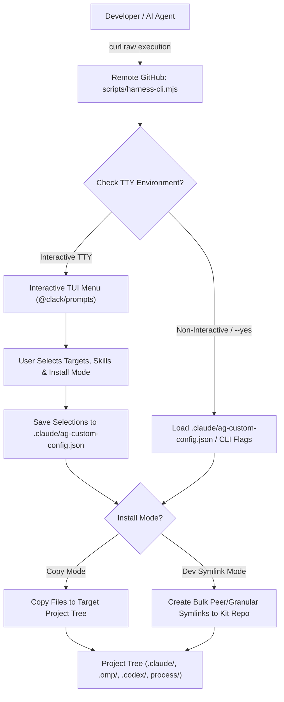

# Interactive Harness Customizer Go CLI System Design

## 1. Overview & Context

This specification defines the system architecture, execution flow, and configuration persistence for the **Interactive Harness Customizer Go CLI (`cmd/ag-cli/main.go`)**.
## 1. Overview & Context

This specification defines the system architecture, execution flow, and configuration persistence for the **Interactive Harness Customizer CLI (`scripts/harness-cli.mjs`)**.

The CLI provides a rich, user-friendly Terminal User Interface (TUI) allowing developers and AI agents to selectively pick, update, or exclude specific harness layers (e.g. `.claude`, `.codex`, `.omp`, `process/`) and individual skills (e.g. `ag-docs`, `ag-git-flow`, `ag-brainstorming`).

### Core Design Principles & Guarantees
- **Zero Root Clutter Guarantee**: Operates completely in RAM/temp memory when invoked via `curl raw`. Writes **zero** script binaries or `.ag-*` tracking files to the user's project root directory.
- **Config Persistence**: User selections are saved to `.claude/ag-custom-config.json` inside the `.claude/` directory, keeping the project root 100% clean and clutter-free.
- **Dual Install Modes (Copy vs. Dev Symlink)**:
  - **Copy Mode (`default`)**: Files are copied directly to the target project. Ideal for end users and production repositories.
  - **Dev Symlink Mode (`--link`)**: Selected harness directories and skills are created as **symbolic links (symlinks)** pointing back to the local kit repository. Supports **Bulk Peer Directory Symlinking** across independent harness layers:
    - `.claude/` $\rightarrow$ `/path/to/agent-skills-kit/.claude/`
    - `.omp/` $\rightarrow$ `/path/to/agent-skills-kit/.omp/`
    - `.codex/` $\rightarrow$ `/path/to/agent-skills-kit/.codex/`
    - `process/development-protocols/` $\rightarrow$ `/path/to/agent-skills-kit/process/development-protocols/`
    - `process/development-protocols/references/` $\rightarrow$ `/path/to/agent-skills-kit/process/development-protocols/references/`
    - Granular skill folders (e.g. `.claude/skills/ag-docs`).
    - Edits in working projects instantly reflect in the master kit repo without manual copying.
- **Dual-Mode Execution**: Seamlessly supports interactive TUI selection in terminal environments and non-interactive automated execution (CI/CD, AI agent runs) via CLI flags and config files.

---

## 2. High-Level Architecture (C4 Level 1 & 2)



---

## 3. Work Breakdown Structure (4-Level WBS Table)

| WBS Code | Component / Feature Name | Level | Detailed Description / Task | Output / Artifact |
| :--- | :--- | :--- | :--- | :--- |
| `1.0` | Harness CLI Module | L1: Module | Core CLI runner and manifest resolver | `scripts/harness-cli.mjs` |
| `1.1` | Interactive TUI Layer | L2: Component | Checkbox multi-select interface for targets, skills, and install mode | `@clack/prompts` TUI menu |
| `1.1.1` | Target Layer Picker | L3: Task | Render selectable checkboxes for `.claude`, `.omp`, `.codex`, `process/` | `promptTargetLayers()` |
| `1.1.1.1` | Selection Ingestion | L4: Execution | Parse checked target paths into JSON array | `targets: [".claude", ".omp", ".codex"]` |
| `1.1.2` | Skill Picker | L3: Task | Render selectable checkboxes for 30+ skills | `promptSkills()` |
| `1.1.2.1` | Skill Filter Matrix | L4: Execution | Categorize skills into include/exclude lists | `skills.include: [...]` |
| `1.1.3` | Install Mode Picker | L3: Task | Render radio option for Copy Mode vs. Dev Symlink Mode | `promptInstallMode()` |
| `1.1.3.1` | Mode Resolution | L4: Execution | Set install mode (`copy` or `symlink`) | `mode: "symlink"` |
| `1.2` | Config Persistence Engine | L2: Component | Read/write `.claude/ag-custom-config.json` | `saveCustomConfig()` |
| `1.3` | Dual Execution Engine | L2: Component | Apply manifest changes via file copy or bulk/granular symlinks | `applyHarnessUpdates()` |

---

## 4. Data Contracts & Configuration Persistence

### Config Schema (`.claude/ag-custom-config.json`)

```json
{
  "$schema": "https://json.schemastore.org/ag-custom-config.json",
  "version": "2.4.2",
  "updatedAt": "2026-08-01T12:00:00.000Z",
  "installMode": "symlink",
  "symlinkScope": "bulk",
  "kitRepoPath": "/home/ngxc/workspace/40-tools/agent-skills-kit",
  "targets": [
    ".claude",
    ".omp",
    ".codex",
    "process/development-protocols"
  ],
  "symlinkTargets": [
    ".claude",
    ".omp",
    ".codex",
    "process/development-protocols/references",
    ".claude/skills/ag-docs"
  ],
  "skills": {
    "mode": "select",
    "include": [
      "ag-docs",
      "ag-git-flow",
      "ag-brainstorming",
      "ag-generate-plan",
      "ag-generate-context"
    ],
    "exclude": [
      "ag-web-testing"
    ]
  },
  "options": {
    "preserveUserContent": true,
    "refuseOverwriteNonSymlinkDir": true
  }
}
```

---

## 5. Execution Protocol & Remote One-Liner

### 1. Interactive Remote One-Liner (User Execution - Copy Mode)
```bash
curl -sSL https://raw.githubusercontent.com/ngxccc/agent-skills-kit/main/scripts/harness-cli.mjs | node -
```

### 2. Developer Dev-Symlink Mode One-Liner (Bulk Directory Symlink)
```bash
bun run ag-cli --link --symlink-scope=bulk --kit-path=/path/to/agent-skills-kit
```

### 3. Non-Interactive CLI Flag Execution (CI/CD & AI Agent)
```bash
curl -sSL https://raw.githubusercontent.com/ngxccc/agent-skills-kit/main/scripts/harness-cli.mjs | node - --targets=.claude,.omp,.codex --skills=ag-docs,ag-git-flow --yes
```
---

## 6. Fail-Safe Boundaries & Safety Invariants

- **`INV-1` (Zero Root Clutter)**: The CLI installer MUST NEVER write executable binaries, tracking files, or config files into the user's project root directory. All configuration resides inside `.claude/ag-custom-config.json`.
- **`INV-2` (Preserve User Content)**: Existing project context files (`process/context/all-context.md`), feature active plans (`process/features/**`), and custom code MUST NOT be overwritten during updates.
- **`INV-3` (Isolated Persistence & Symlink Fallback)**: Custom configuration MUST live inside `.claude/`. If Dev Symlink Mode fails (e.g. broken path), fall back safely to Copy Mode after warning.
- **`INV-4` (Non-Symlink Safety Guard)**: The Symlink Engine MUST refuse to replace/overwrite existing real (non-symlink) directories containing uncommitted local files without explicit `--force` confirmation.
