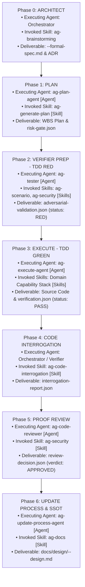

# Architect & Verifier Autonomous Operational Playbook (Master Workflow Guide)

> **Agent Execution Mandate:** This document defines the mandatory, autonomous state machine for executing technical changes across the `agent-skills-kit` harness: Idea $\rightarrow$ Formal Spec $\rightarrow$ Frozen TDD Suite $\rightarrow$ Counter-Example Loop $\rightarrow$ Socratic Interrogation $\rightarrow$ Proof Review $\rightarrow$ Operational SSOT Documentation.
>
> All AI Agents (Orchestrators, Subagents, and Specialist Roles) MUST execute this state machine sequentially for all High-Risk tasks without relying on manual user prompts.

---

## 1. Task Risk Classification & Activation Protocol

Before executing any request, agents MUST evaluate the task scope against this matrix to determine the execution mode.

| Task Class          | Trigger Conditions                                                                                                                                                                                                                                                       | Mandatory Workflow Mode                                                                  | Required Harness Artifacts                                                                                                                                                                                                                       |
| :------------------ | :----------------------------------------------------------------------------------------------------------------------------------------------------------------------------------------------------------------------------------------------------------------------- | :--------------------------------------------------------------------------------------- | :----------------------------------------------------------------------------------------------------------------------------------------------------------------------------------------------------------------------------------------------- |
| **High-Risk Class** | • Auth, JWT, OAuth & Identity boundaries<br>• Billing, Checkout & Payment Transactions<br>• DB Schema Migration / Destructive Mutation<br>• Public API Contract & DTO Changes<br>• Runtime / Gateway / Proxy / Middleware<br>• Permission Matrices & Security Boundaries | **Autonomous Architect & Verifier Protocol**<br>(Phases 0 $\rightarrow$ 6 State Machine) | • `process/features/[feature]/active/[feature-slug]-[topic-slug]-formal-spec.md`<br>• `risk-gate.json`<br>• `adversarial-validation.json`<br>• `verification.json`<br>• `interrogation-report.json`<br>• `review-decision.json`<br>• `docs/adr/` |
| **Low-Risk Class**  | • Minor bug fixes (< 15 lines of code)<br>• UI / CSS / Formatting tweaks<br>• Typo fixes & non-logic configuration updates                                                                                                                                               | **Lightweight RIPER-5 / Fast Mode**<br>(Bypass Formal Spec & Heavyweight Gate)           | • Active Plan file or Fast Mode Plan                                                                                                                                                                                                             |

### 1.1 Harness Entity Classification: Agents vs. Skills

To prevent confusion during orchestration, the harness strictly distinguishes between **Agents** (Autonomous Workers) and **Skills** (Protocol Instructions):

- **Agents (Subagents / Actors):** Independent AI sub-processes spawned via the `task` tool (e.g. `agent: "plan-agent"`). They run in isolated contexts with dedicated system prompts and tool permissions.
- **Skills (Protocols / Guidelines / Automation Scripts):** Reusable knowledge, step-by-step methodologies, and validation scripts read or executed by an active agent (e.g. `skill://ag-code-interrogation`). **Skills DO NOT spawn new agent processes.**

| Entity Name               | Entity Type | How to Trigger / Activate                       | Operational Purpose                                                                             |
| :------------------------ | :---------- | :---------------------------------------------- | :---------------------------------------------------------------------------------------------- |
| `ag-brainstorming`        | **Skill**   | Load `skill://ag-brainstorming`                 | Protocol for Socratic design, trade-off matrix, and Formal Spec creation                        |
| `ag-plan-agent`           | **Agent**   | Spawn via `task(agent: "plan-agent")`           | Actor agent for generating WBS plans and manifests                                              |
| `ag-generate-plan`        | **Skill**   | Load `skill://ag-generate-plan`                 | Contract skill defining SIMPLE/COMPLEX plan formats                                             |
| `ag-tester`               | **Agent**   | Spawn via `task(agent: "tester")`               | Actor agent for generating Property-Based & Level 2 TDD RED test suites                         |
| `ag-scenario`             | **Skill**   | Load `skill://ag-scenario`                      | Helper skill for generating edge-case scenarios across 12 dimensions                            |
| `ag-security`             | **Skill**   | Load `skill://ag-security`                      | Helper skill for STRIDE/OWASP threat scanning and SAST guidelines                               |
| `ag-execute-agent`        | **Agent**   | Spawn via `task(agent: "execute-agent")`        | Actor agent for implementing code and counter-example bug fixing                                |
| `ag-code-interrogation`   | **Skill**   | Load `skill://ag-code-interrogation`            | Protocol skill executing 5-Layer Cognitive Stack Q&A & Socratic Gate                            |
| `ag-code-reviewer`        | **Agent**   | Spawn via `task(agent: "code-reviewer")`        | Actor agent for Proof Review Gate & pre-PR quality checks                                       |
| `ag-update-process-agent` | **Agent**   | Spawn via `task(agent: "update-process-agent")` | Actor agent for archiving specs, validating docs, and exporting SSOT                            |
| `ag-docs`                 | **Skill**   | Load `skill://ag-docs`                          | Contract skill for managing project documentation, design docs (`docs/design/`), ADRs, and RFCs |

## 2. End-to-End State Machine Architecture



### State Transition Preconditions & Deliverable Gates

| From State                   | To State                     | Gate Condition / Prerequisite                                                                         | Verified By Agent                   | Active Protocol Skill                   |
| :--------------------------- | :--------------------------- | :---------------------------------------------------------------------------------------------------- | :---------------------------------- | :-------------------------------------- |
| **Phase 0 (ARCHITECT)**      | **Phase 1 (PLAN)**           | Formal Spec written to `process/features/[feature]/active/[feature-slug]-[topic-slug]-formal-spec.md` | Orchestrator                        | `ag-brainstorming`                      |
| **Phase 1 (PLAN)**           | **Phase 2 (VERIFIER PREP)**  | WBS Plan created and `risk-gate.json` initialized with `formalSpecPath`                               | `ag-plan-agent` _(Agent)_           | `ag-generate-plan` _(Skill)_            |
| **Phase 2 (VERIFIER PREP)**  | **Phase 3 (EXECUTE)**        | Level 2 tests frozen into `adversarial-validation.json` with status `RED`                             | `ag-tester` _(Agent)_               | `ag-scenario`, `ag-security` _(Skills)_ |
| **Phase 3 (EXECUTE)**        | **Phase 4 (INTERROGATION)**  | All frozen tests PASS; `verification.json` status is `PASS` (0 failures)                              | `ag-execute-agent` _(Agent)_        | Domain Plugins _(Skills)_               |
| **Phase 4 (INTERROGATION)**  | **Phase 5 (PROOF REVIEW)**   | 5-Layer Socratic Interrogation passed; `interrogation-report.json` emitted                            | Orchestrator / Verifier             | `ag-code-interrogation` _(Skill)_       |
| **Phase 5 (PROOF REVIEW)**   | **Phase 6 (UPDATE PROCESS)** | `review-decision.json` contains `mustStopBeforeFinalize: false` & `verdict: "APPROVED"`               | `ag-code-reviewer` _(Agent)_        | `ag-security` _(Skill)_                 |
| **Phase 6 (UPDATE PROCESS)** | **COMPLETED**                | Docs audit passes 100%; operational SSOT exported to `docs/design/`                                   | `ag-update-process-agent` _(Agent)_ | `ag-docs` _(Skill)_                     |

---

## 3. Phase-by-Phase Execution Protocol

### Phase 0: ARCHITECT (`ag-brainstorming`)

- **Executing Agent:** Orchestrator (Main Session).
- **Invoked Skill:** `ag-brainstorming` (`skill://ag-brainstorming`).
- **Autonomous Execution Algorithm:**
  1. Identify High-Risk triggers (Auth, Billing, DB Schema, API Contract, Security).
  2. Conduct **One-Question Grilling**: Ask single, focused questions (with 2-4 concrete options per turn) to discover:
     - **System Invariants:** Non-negotiable logic rules (e.g., `INV-1: Balance cannot drop below zero`).
     - **Fail-Safe Boundary:** Safe fallback behavior under unexpected exceptions.
     - **Level 2 Edge Cases:** Concurrency, race conditions, adversarial payloads.
  3. Author the Formal Spec file at `process/features/[feature]/active/[feature-slug]-[topic-slug]-formal-spec.md` using template `process/development-protocols/references/formal-spec-template.md`.
  4. If architectural decisions were made, write an ADR to `docs/adr/000X-[kebab-case-name].md`.
- **Output Deliverables:** `[feature-slug]-[topic-slug]-formal-spec.md`, optional ADR file.

---

### Phase 1: PLAN (`ag-plan-agent` / `ag-generate-plan`)

- **Executing Agent:** `ag-plan-agent` (Subagent spawned via `task(agent: "plan-agent")`).
- **Invoked Skill:** `ag-generate-plan` (`skill://ag-generate-plan`).
- **Autonomous Execution Algorithm:**
  1. Parse the Formal Spec; extract all System Invariants (`INV-1`, `INV-2`, etc.).
  2. Create active Plan file at `process/features/[feature]/active/[feature-slug]-plan-[dd-mm-yy].md`.
  3. Include `formalSpecPath` in the Plan header.
  4. Decompose work into a 3-column Primitive Atomic WBS Table (Phase, Task, Acceptance Criteria).
  5. Initialize `risk-gate.json` at `process/features/[feature]/reports/harness/[planSlug]/risk-gate.json`.
- **Output Deliverables:** Active Plan file, `risk-gate.json`.

---

### Phase 2: VERIFIER PREP - TDD RED (`ag-tester` / `ag-security` / `ag-scenario`)

- **Executing Agent:** `ag-tester` (Subagent spawned via `task(agent: "tester")`).
- **Invoked Helper Skills:** `ag-scenario` (`skill://ag-scenario`), `ag-security` (`skill://ag-security`).
- **Autonomous Execution Algorithm:**
  1. Read System Invariants from `formalSpecPath`.
  2. Generate Level 2 Property-Based Tests (`fast-check`), race condition simulations, and boundary limit tests.
  3. Write test code into test suite files (e.g., `tests/[feature]/[scenario].test.ts`).
  4. Freeze test suite metadata into `process/features/[feature]/reports/harness/[planSlug]/adversarial-validation.json` with all items set to status `RED`.
  5. Run test runner to confirm 100% of frozen tests fail prior to implementation (TDD RED confirmation).
- **Output Deliverables:** Test code files, `adversarial-validation.json` (status: `RED`).

---

### Phase 3: EXECUTE - TDD GREEN & COUNTER-EXAMPLE LOOP (`ag-execute-agent`)

- **Executing Agent:** `ag-execute-agent` (Subagent spawned via `task(agent: "execute-agent")`).
- **Invoked Domain Skills:** Contextual stack skills (`nextjs`, `zod`, `drizzle`, etc.).
- **Autonomous Execution Algorithm:**
  1. Read Formal Spec invariants and frozen test matrix.
  2. Write source code implementation complying strictly with 100% of System Invariants.
  3. Run test runner.
  4. If any test fails, write structured counter-example details to `process/features/[feature]/reports/harness/[planSlug]/verification.json`:
     - Capture `violatedInvariant`, `counterExample` (initial state, inputs, timing, expected vs actual), and `instructionForCoder`.
  5. Refactor source code iteratively driven by counter-example payloads until 100% of tests PASS.
  6. Update `verification.json` status to `PASS`.
- **Output Deliverables:** Implementation source code, `verification.json` (`status: "PASS"`).

---

### Phase 4: CODE INTERROGATION (`ag-code-interrogation`)

- **Executing Agent:** Orchestrator (or dedicated Verifier Agent).
- **Invoked Protocol Skill:** `ag-code-interrogation` (`skill://ag-code-interrogation`).
- **Autonomous Execution Algorithm:**
  1. Inspect the git diff against `formalSpecPath`.
  2. Execute the **5-Layer Cognitive Stack Interrogation Protocol**:
     - **Layer 1 (Intuition & Bias Filtering):** Challenge confirmation bias and AI-generated code assumptions.
     - **Layer 2 (Inquiry & Deconstruction):** Deconstruct core logic and verify invariant defense mechanisms.
     - **Layer 3 (Systems Thinking & Second-Order Effects):** Probe concurrency, DB locks, IO, memory, and API caller impacts.
     - **Layer 4 (Innovation & Divergent Thinking):** Evaluate trade-off choices and inversion failure modes.
     - **Layer 5 (Execution & Proof):** Inspect concrete execution logs, telemetry, and test assertion evidence.
  3. Emit interrogation report to `process/features/[feature]/reports/harness/[planSlug]/interrogation-report.json`.
- **Output Deliverables:** `interrogation-report.json` (`gateVerdict: "PASS"`).

---

### Phase 5: PROOF REVIEW GATE (`ag-code-reviewer` / `ag-security`)

- **Executing Agent:** `ag-code-reviewer` (Subagent spawned via `task(agent: "code-reviewer")`).
- **Invoked Helper Skill:** `ag-security` (`skill://ag-security`).
- **Autonomous Execution Algorithm:**
  1. Conduct SAST security audit and invariant verification on git diff.
  2. Verify zero regressions against security boundaries and System Invariants.
  3. Emit review decision to `process/features/[feature]/reports/harness/[planSlug]/review-decision.json`:
     - Set `mustStopBeforeFinalize: false` and `verdict: "APPROVED"`.
- **Output Deliverables:** `review-decision.json`.

---

### Phase 6: UPDATE PROCESS & SSOT EXPORT (`ag-update-process-agent`)

- **Executing Agent:** `ag-update-process-agent` (Subagent spawned via `task(agent: "update-process-agent")`).
- **Invoked Contract/Helper Skills:** `ag-docs` (`skill://ag-docs`).
- **Autonomous Execution Algorithm:**
  1. Run mandatory doc audit script:
     `bun run .claude/skills/ag-docs/scripts/validate-docs.mjs`
  2. Archive Formal Spec: Move `process/features/[feature]/active/[feature-slug]-[topic-slug]-formal-spec.md` to `process/features/[feature]/completed/`.
  3. Synthesize project design specifications using `ag-docs` (design mode) and export SSOT project design doc to:
     `docs/design/<feature-slug>-<topic-slug>-design.md`.
- **Output Deliverables:** Validated docs, archived spec, `docs/design/<feature-slug>-<topic-slug>-design.md`.

---

## 4. Harness Artifact Schemas & Directory Layout (SSOT)

### Directory Standard

```
process/features/{feature-slug}/
├── active/
│   ├── [feature-slug]-[topic-slug]-formal-spec.md   <-- Formal Spec (Pre-Implementation)
│   └── [feature-slug]-plan-[dd-mm-yy].md           <-- Active Plan file
├── reports/
│   └── harness/
│       └── [planSlug]/
│           ├── risk-gate.json                  <-- Declares formalSpecPath & risk class
│           ├── adversarial-validation.json     <-- Frozen Level 2 Tests (TDD RED)
│           ├── verification.json               <-- Counter-Example Logs & Test Output (TDD GREEN)
│           ├── interrogation-report.json       <-- Socratic Interrogation Result
│           └── review-decision.json            <-- Proof Verification Gate Report
└── completed/                                  <-- Archived Spec location upon completion

docs/adr/
docs/rfc/
docs/design/
└── <feature-slug>-<topic-slug>-workflow.md        <-- Operational SSOT Document (kebab-case)

### JSON Schemas & Reference Specification (SSOT)

> **Canonical Schema Specification:** All harness JSON artifacts MUST strictly comply with the **Harness JSON Artifacts Schema & Specification (SSOT v2.0.0)** defined at:
> [`process/development-protocols/references/harness-schemas.md`](process/development-protocols/references/harness-schemas.md)

Refer to [`harness-schemas.md`](process/development-protocols/references/harness-schemas.md) for the complete JSON Schema (Draft-07 compliant) definitions and rich production templates for:
1. **`risk-gate.json`**: Risk classification, System Invariants, formal specification links, and verification gates.
2. **`adversarial-validation.json`**: Frozen Level 2 Property-Based, Adversarial Matrix & Edge Case test suites.
3. **`verification.json`**: Execution test results, layer-by-layer coverage maps, and Counter-Example payload contracts.
4. **`review-decision.json`**: Gatekeeper verification report, verdict, and manifest references before finalize.
```

---

## 5. Skill & Agent Orchestration Inventory

Despite the harness having 50+ skills in total, the core Architect & Verifier state machine operates on a lean, deterministic backbone of **6 Core Skills** and **5 Specialist Agents**.

### Core Workflow Engine Matrix

| Phase       | State / Step            | Primary Agent (Spawn Target)  | Core Skills Invoked (Instruction Protocol) | Harness Deliverable                                 |
| :---------- | :---------------------- | :---------------------------- | :----------------------------------------- | :-------------------------------------------------- |
| **Phase 0** | ARCHITECT               | Orchestrator (Main Session)   | `ag-brainstorming`                         | `[feature-slug]-[topic-slug]-formal-spec.md`, ADR   |
| **Phase 1** | PLAN                    | `ag-plan-agent`               | `ag-generate-plan`                         | Active Plan file, `risk-gate.json`                  |
| **Phase 2** | VERIFIER PREP (TDD RED) | `ag-tester`                   | `ag-scenario`, `ag-security`               | `adversarial-validation.json` (status: RED)         |
| **Phase 3** | EXECUTE (TDD GREEN)     | `ag-execute-agent`            | Domain Capability Stack Skills             | Source Code, `verification.json` (status: PASS)     |
| **Phase 4** | CODE INTERROGATION      | Orchestrator / Verifier Agent | `ag-code-interrogation`                    | `interrogation-report.json`                         |
| **Phase 5** | PROOF REVIEW            | `ag-code-reviewer`            | `ag-security`                              | `review-decision.json` (verdict: APPROVED)          |
| **Phase 6** | UPDATE PROCESS & SSOT   | `ag-update-process-agent`     | `ag-docs`                                  | `docs/design/<feature-slug>-<topic-slug>-design.md` |

### Quick Invocation Cheat Sheet

```ts
// Example: Spawning an Agent (Subagent execution)
task({
  agent: "plan-agent", // <-- AGENT ID (Omits 'ag-' prefix when calling task tool)
  task: "Generate WBS implementation plan for Formal Spec...",
});

// Example: Invoking a Skill (Context loading & Protocol instructions)
// Active Agent reads skill://<skill-name> (e.g., skill://ag-code-interrogation)
```
