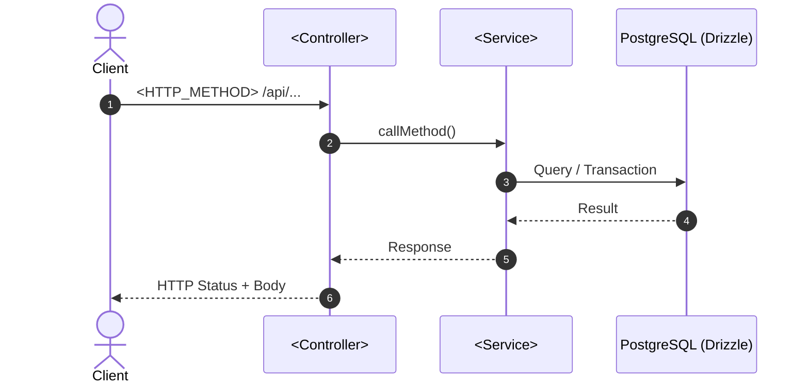
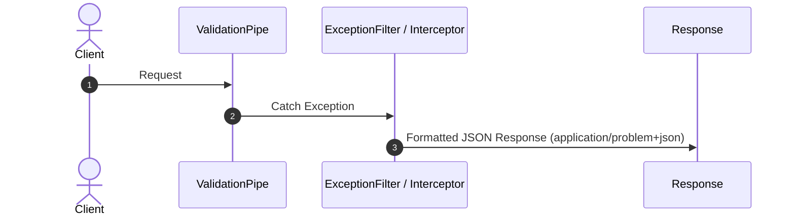

# Quy Chuẩn & Mẫu Viết Tài Liệu Workflow (Workflow Documentation Standard)

Tài liệu này định nghĩa **Chuẩn Cốt Lõi (Single Source of Truth - SSOT)** cho việc biên soạn tất cả các tài liệu mô tả luồng (Workflow Docs) trong thư mục `second-brain/Docs/` hoặc `process/references/`.

---

## 1. Phân Loại Tài Liệu Workflow (Document Archetypes)

Hệ thống phân chia tài liệu Workflow thành **2 loại chính (Document Types)** thông qua trường Frontmatter `docType`:

| Trường Frontmatter                 | Loại Tài Liệu               | Đối Tượng Áp Dụng                                                                    | Đặc Điểm Cốt Lõi                                                                                                                                                                   |
| :--------------------------------- | :-------------------------- | :----------------------------------------------------------------------------------- | :--------------------------------------------------------------------------------------------------------------------------------------------------------------------------------- |
| `docType: feature-workflow`        | **Feature Workflow**        | Các tính năng nghiệp vụ (Auth, Booking, Payment, Ticket)                             | Tập trung vào luồng nghiệp vụ, Bảng phân rã WBS 4 cấp, Sơ đồ Sequence, Quyết định DB/Outbox, Phòng thủ nhiều lớp (Defense-in-Depth), và Checklist triển khai.                      |
| `docType: infrastructure-workflow` | **Infrastructure Workflow** | Các thành phần hạ tầng kỹ thuật (Filters, Interceptors, Guards, Outbox Relay, Pipes) | Tập trung vào kiến trúc hệ thống, Sơ đồ luồng xử lý ngoại lệ/middleware, Bản thiết kế mã nguồn (Blueprint), Kiểm tra rò rỉ dữ liệu (Data Leak Audit), và Checklist kiểm thử/audit. |

---

## 2. Chuẩn Bảng Phân Rã Chức Năng (WBS Table Standard)

Mọi tài liệu `feature-workflow` (và `infrastructure-workflow` nếu có phân rã phức tạp) **bắt buộc dùng Bảng Markdown WBS** làm chuẩn phân rã mặc định thay vì Mermaid graph.

### Lý Do Chọn Bảng Markdown Làm Mặc Định

1. **Phân cấp đánh số rõ ràng**: Hỗ trợ đánh số thứ tự từ L1 đến L4 (`1.0` -> `1.1` -> `1.1.1` -> `1.1.1.1`).
2. **Tra cứu Artifact chính xác**: Mỗi dòng WBS đều chỉ định rõ file mã nguồn, DTO, Schema hoặc HTTP Status trả về.
3. **Tiết kiệm Không Gian**: Tránh việc sơ đồ Mermaid quá rộng gây khó đọc trên các màn hình nhỏ.

### Khung Cấu Trúc Bảng WBS Mẫu (WBS Table Template)

| Mã WBS    | Tên Thành Phần / Chức Năng  | Phân Cấp (Level)  | Mô Tả Chi Tiết / Nhiệm Vụ          | Output / Artifact          |
| :-------- | :-------------------------- | :---------------- | :--------------------------------- | :------------------------- |
| **1.0**   | **[Tên Module]**            | **L1: Module**    | Phân vùng module tổng thể          | `src/modules/[module]`     |
| **1.1**   | **[Tên Feature/Component]** | **L2: Component** | Chức năng / Thành phần chi tiết    | `[HTTP_METHOD] /api/...`   |
| **1.1.1** | **[Tên Lớp Logic/Guard]**   | **L3: Logic**     | Xử lý middleware / guard / DTO     | `[file.guard.ts / dto.ts]` |
| 1.1.1.1   | Task Nhỏ 1                  | L4: Execution     | Logic cụ thể (Validate, Transform) | `src/...`                  |
| 1.1.1.2   | Task Nhỏ 2                  | L4: Execution     | Xử lý lỗi / Exception              | `src/...`                  |
| **1.1.2** | **[Tên Service/Database]**  | **L3: Logic**     | Logic nghiệp vụ & Giao dịch DB     | `[service.ts]`             |
| 1.1.2.1   | Query / Transaction         | L4: Execution     | DB Query / Outbox Event            | `src/database/schemas/...` |

---

## 3. Template Loại 1: Feature Workflow (`docType: feature-workflow`)

Dành cho các nghiệp vụ như `Register`, `Login`, `Change Password`, `Book Ticket`.

```markdown
---
title: <Tên Feature> Workflow & Architecture Spec
tags:
  - type/workflow
  - topic/<module>
docType: feature-workflow
status: draft # draft | approved | implemented
date: YYYY-MM-DD
---

# Phân Tích & Thiết Kế Workflow: <Tên Feature> (<Feature Name> Flow)

**Trạng thái**: ⏳ Draft / ✅ Approved / 🚀 Implemented  
**Module**: `src/modules/<module-name>`  
**Route/Endpoint**: `<HTTP_METHOD> /api/<path>`

---

## 1. Sơ Đồ Phân Rã Chức Năng (Work Breakdown Structure - WBS)

| Mã WBS    | Thành Phần / Chức Năng  | Mô Tả Chi Tiết / Nhiệm Vụ | Output / Artifact        |
| :-------- | :---------------------- | :------------------------ | :----------------------- |
| **1.0**   | **<Module Name>**       | Quản lý ...               | `src/modules/<module>`   |
| **1.1**   | **<Feature Name>**      | Chức năng ...             | `<HTTP_METHOD> /api/...` |
| **1.1.1** | **Guard & Validation**  | ...                       | `src/...`                |
| 1.1.1.1   | Logic Task              | ...                       | `src/...`                |
| **1.1.2** | **Business Logic & DB** | ...                       | `src/...`                |

---

## 2. Sơ Đồ Luồng Tuần Tự (Sequence Diagram)



---

## 3. Quyết Định Kiến Trúc & Thiết Kế Kỹ Thuật (Tech Decisions)

### 3.1 Routing & DTO Schema

- Code Snippet DTO Validation & Transformer.

### 3.2 Service Logic & Transaction Strategy

- Code Snippet Service / Transaction / Outbox Pattern.

---

## 4. Chiến Lược Bảo Vệ Nhiều Lớp (Defense-in-Depth & Security)

- **Lớp 1: CDN / Gateway Rate Limit** (Anti-DDoS)
- **Lớp 2: Application Throttler Guard** (Anti-Bruteforce per IP)
- **Lớp 3: Business Identity Verification** (Password hashing, Session Revocation)

---

## 5. Kế Hoạch Triển Khai (Implementation Checklist)

- [ ] **Bước 1**: Tạo DTO & Validation rules
- [ ] **Bước 2**: Triển khai Service logic & DB Query
- [ ] **Bước 3**: Viết Unit Test & Integration Test

---

## 6. Tài Liệu Liên Quan

- [[Link_To_Atomic_Note_1]]
- [[Link_To_Atomic_Note_2]]
```

---

## 4. Template Loại 2: Infrastructure Workflow (`docType: infrastructure-workflow`)

Dành cho các hạ tầng như `GlobalExceptionFilter`, `JwtAuthGuard`, `LoggingInterceptor`.

```markdown
---
title: <Tên Lowercase Component> Implementation & Workflow Audit Guide
tags:
  - type/infrastructure
  - topic/nestjs
docType: infrastructure-workflow
status: approved
date: YYYY-MM-DD
---

# <Tên Component> Implementation & Workflow Audit Guide

**Trạng thái**: ✅ Approved / 🚀 Implemented  
**Phạm vi**: Cross-cutting / Global Infrastructure  
**Vị trí mã nguồn**: `src/common/<type>/<filename>.ts`

---

## 1. Executive Summary & Architecture Goal

- Mục tiêu kiến trúc & bài toán giải quyết.
- Tiêu chuẩn tuân thủ (ví dụ: RFC 9457, OpenTelemetry, NestJS Spec).

---

## 2. Operational & Exception Sequence Diagram



---

## 3. Detailed Implementation Blueprint

### Step 1: Configuration / Bootstrap (`src/main.ts`)

- Code snippet cấu hình global.

---

### Step 2: Core Class Implementation (`src/common/...`)

- Code snippet của Class chính.

---

## 4. Security & Data Leak Safeguards

- **Sanitization**: Loại bỏ Stack Trace trên môi trường Production.
- **SQL Error Shielding**: Ẩn các câu lệnh SQL thô khỏi response client.
- **Header Enforcement**: Thiết lập Header an toàn (`Content-Type: application/problem+json`).

---

## 5. Audit & Verification Checklist

- [ ] **Header Check**: Đảm bảo Content-Type đúng chuẩn.
- [ ] **Parity Check**: Format nhất quán giữa DTO error và Domain exception.
- [ ] **Production Leak Audit**: Kiểm tra không rò rỉ thông tin nhạy cảm.

---

## 6. Tài Liệu Liên Quan

- [[Link_To_Atomic_Note_1]]
```

---

## 5. Quy Tắc Đặt Tên File (File Naming Conventions)

Tất cả các tệp tài liệu trong `second-brain/Docs/` hoặc `process/references/` **bắt buộc tuân theo quy tắc đặt tên thống nhất**:

| Loại Tài Liệu           | Quy Tắc Cú Pháp Tên File                   | Hậu Tố (Suffix) Bắt Buộc | Ví Dụ Thực Tế                                                       |
| :---------------------- | :----------------------------------------- | :----------------------- | :------------------------------------------------------------------ |
| **Workflow / Spec**     | `PascalCase_With_Underscores_Workflow.md`  | `_Workflow.md`           | `Change_Password_Workflow.md`, `Global_Exception_Filter_Workflow.md` |
| **Deep Dive / Concept** | `PascalCase_With_Underscores_Deep_Dive.md` | `_Deep_Dive.md`          | `RFC_9457_Problem_Details_Deep_Dive.md`                             |
| **Quy Chuẩn / Standard**| `PascalCase_With_Underscores_Standard.md`  | `_Standard.md`           | `Workflow_Documentation_Standard.md`                                |
| **Mẫu Bản Vẽ / Template**| `PascalCase_With_Underscores_Template.md`  | `_Template.md`           | `WBS_Table_Template.md`                                             |

### Quy tắc định dạng:
1. Dùng **`PascalCase`** cho các từ tiếng Anh và nối nhau bằng **dấu gạch dưới `_`** (Underscore).
2. Không dùng dấu gạch ngang `-` trong tên file để tránh nhầm lẫn với slug URL.
3. Ưu tiên lưu file vào thư mục `second-brain/Docs/<Topic>/` nếu có sẵn trong dự án; nếu không có, lưu vào `process/general-plans/references/` hoặc `process/features/<topic>/references/`.
